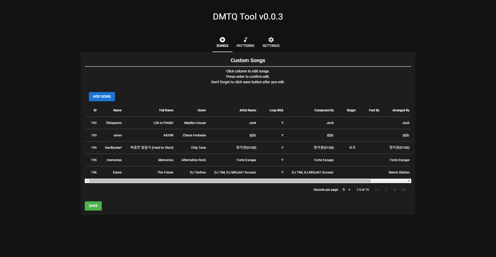

# DMTQ Tool
A tool to manage custom songs and patterns in DMTQ.

  

## Usage
- Download and install exe from [release page](https://github.com/rogeraabbccdd/DMTQ-Tool/releases/latest)
- Set your server files path in settings page.
- You don't need to compress `.opus` preview audio and `d3_e33.unity3d` when you add new songs.
- Compress `patch_new.csv` to lz4 by using [samnyan's DMTQ Tools](https://github.com/samnyan/DMTQ-Tools)
